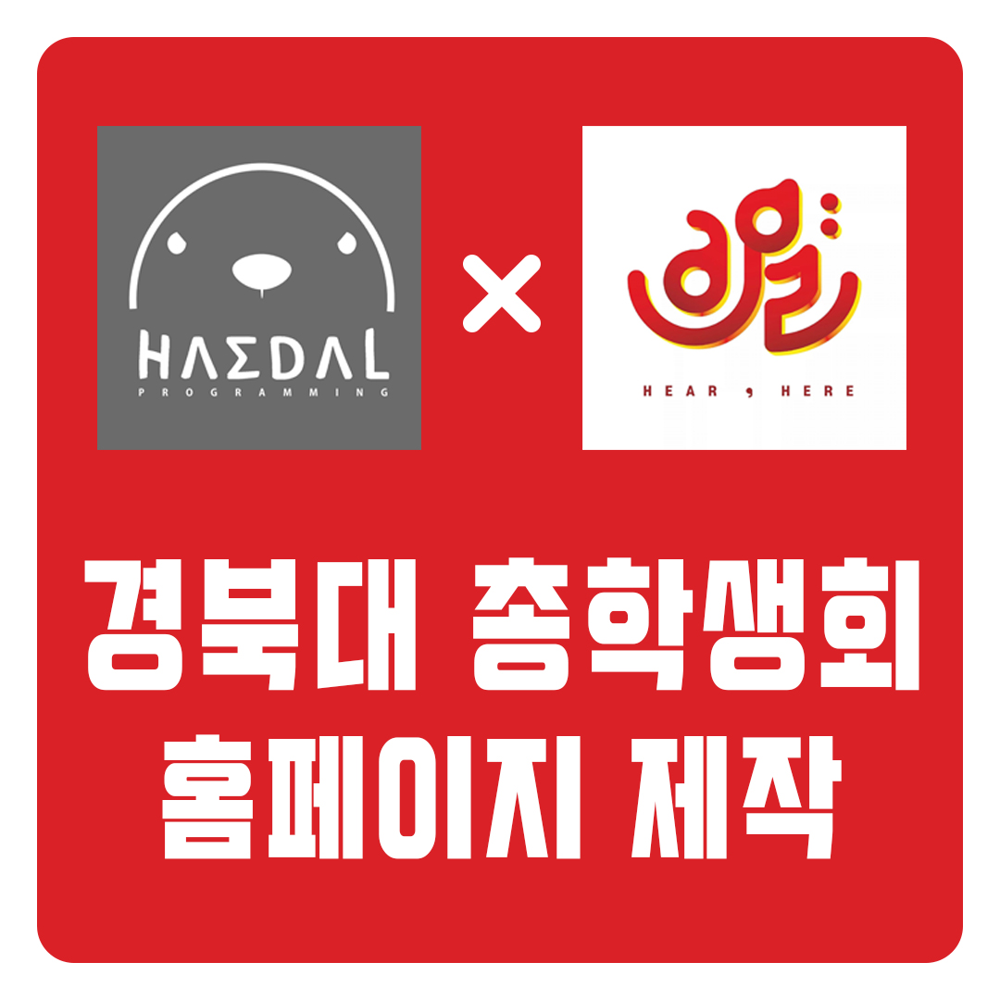
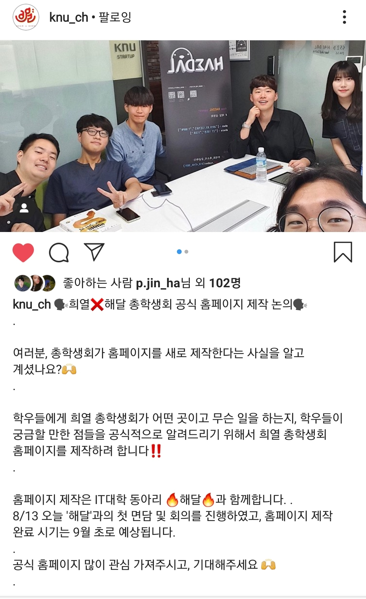
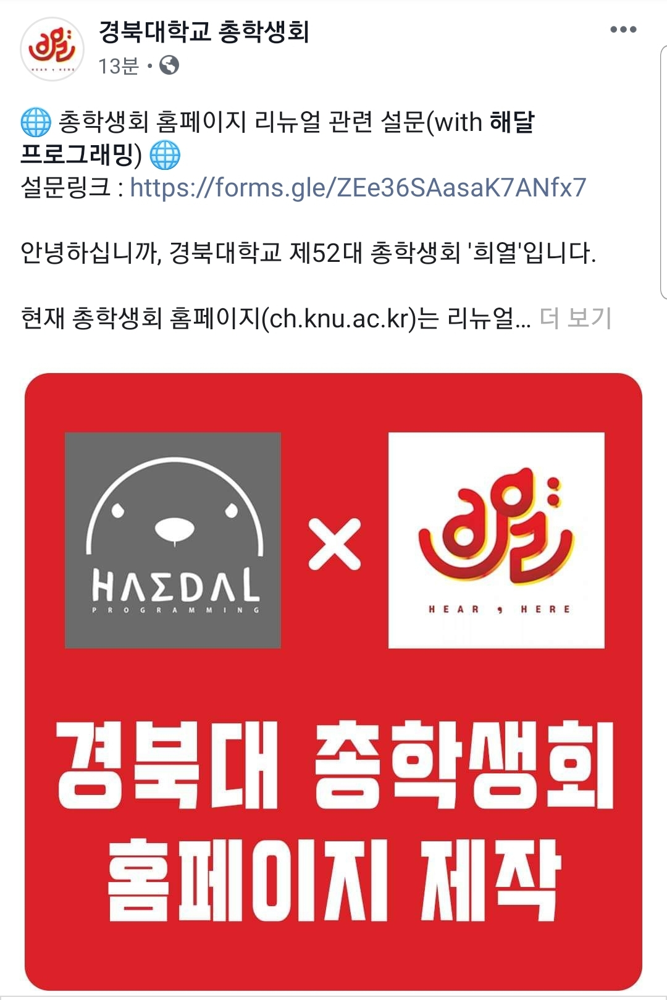
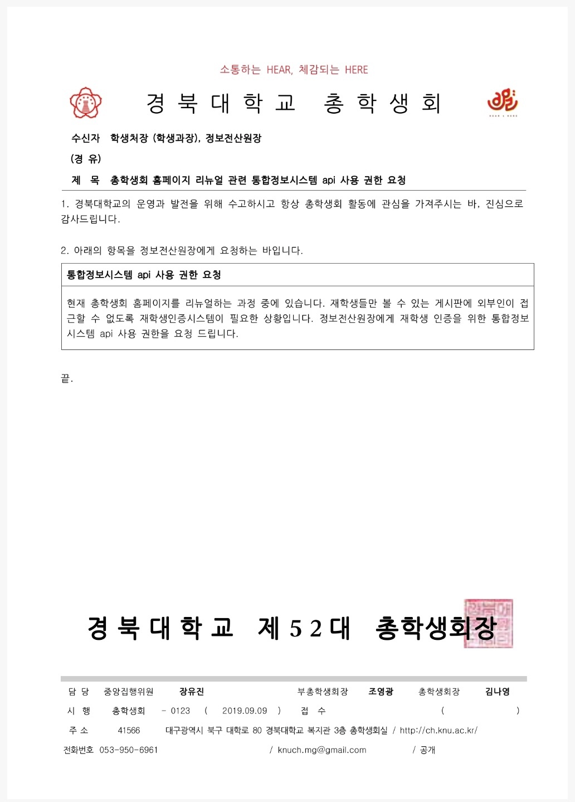

# 경북대학교 총학생회 홈페이지 제작
> 최강민, 이준병, 김주원, 신준철, ~한영민~

## 1차 회의

* [고려대학교 총학생회 홈페이지](http://koreastudent.kr/) 참고해 진행해봅니다
    - 게시판별로 만들기
    - 달력 없애기
    - 일반 학우 로그인 없애기 + Admin은 총학 (+ 일반유저는 단대별로)

* [경북대학교 심볼마크 색상](https://www.knu.ac.kr/wbbs/) 참고해 경북대 브랜드 칼라 사용
    - CSS로 미리 작업해 `Class`통해 색상 먹이도록 작업

* 페이지 나누기
    - 메인(`main`)
    - 총학생회 소개(`instructions`)
    - 총학생회 소식(`news`)
    - 규정집 / 자료집(`rules`)
    - 편의정보(`informations`)
* 페이지 구성
    - navbar + contents + footer

## 2차 회의
 * 서버
    1. 본부 서버 사용
    2. 총학 서버 사용
    3. 아마존 서버 사용

 * 로그인
    - 로그인은 일반 학우들은 하지 못하고 총학이랑 단대만 할 수 있도록

 * 게시판
    - 회장단 / 중집위(희열임원들) / 중운위
    - 중집위 게시판 내에 국별 게시판
    - 중운위 게시판 내에 단대별 게시판 만들면 될 듯
    - 상주위 총동연 게시판은 고민 중

 * 설문조사
    - [구글폼](https://forms.gle/ZEe36SAasaK7ANfx7) 완성되면 목요일 밤에 게시

 * 다음 회의
    - 8/23 10:30 AM

## 개발 이슈
* 경북대 총학생회 메뉴 수정

    메인(`main`)

    총학생회 소개(`instructions`)
    - 역대 총학생회
    - 총학생회장단 인사
    - 총학생회 조직도

    중앙집행위원회(`excution`)
    - 국별 소개
    - 게시판

    중앙운영위원회(`operation`)
    - 단위별 소개
    - 게시판

    자료실(`information`)
    - 회칙
    - 안건지/회의록

## 정보전산원 공문
